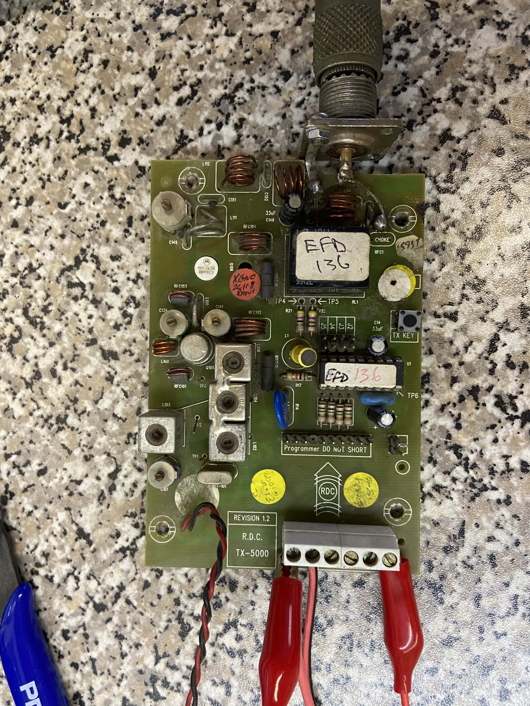
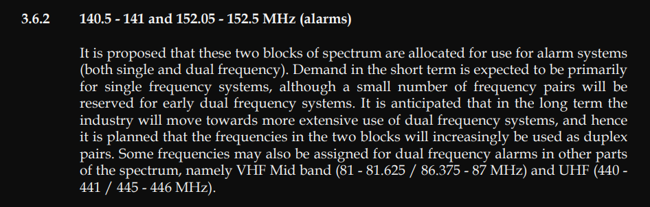

# Old VHF Radio Alarm

RDC TX-5000 (aka TX5 Old).

Uses **SABRE** frequencies for alarm systems **VHF** `140.5-141.0` & **VHF** `152.05-152.5`.

This particular version uses 12v and has 4 outputs for triggering sensors.

Sensors are triggered by pulling them high to 12v.

It also has a linear power supply using a `7812A JRC` for charging a 12v 7A battery.

This power supply is a bit dangerous since it will get stressed from charging a flat battery.

It also has close proximity between mains live in, neutral in in and ground...

Links:
- [RDC Website](https://www.radiodata.co.za)
- [VHF Transmitters Page](https://www.radiodata.co.za/vhf_transmitters.php)
- [Linkedin Page](https://za.linkedin.com/company/radio-data-communication)
